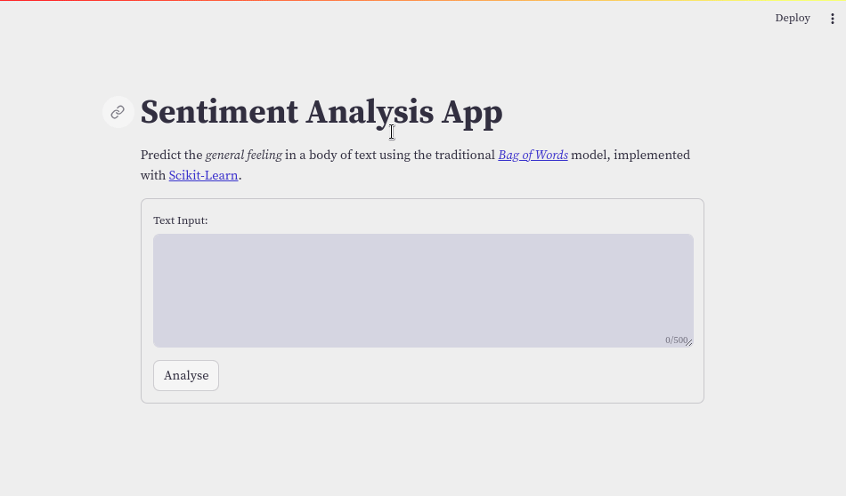

# Sentiment Analysis App

[](https://github.com/Tim-Abwao/sentiment-analysis-app/actions/workflows/run-tests.yml)

Perform [sentiment analysis][sentiment-analysis] using the traditional [bag of words][b-o-w] technique with [TF-IDF weighting][tfidf].

Powered by [Scikit-learn][sklearn] and [Streamlit][streamlit].

[][live-app]

## Running Locally

>**NOTE:** Requires Python 3.10 and above.

1. Download the code, and create a virtual environment:

    ```bash
    git clone https://github.com/Tim-Abwao/sentiment-analysis-app.git
    cd sentiment-analysis-app
    python3 -m venv venv
    source venv/bin/activate
    ```

2. Install dependencies:

    ```bash
    pip install -U pip
    pip install -r requirements.txt
    ```

3. Launch the app:

    ```bash
    streamlit run streamlit_app.py
    ```

## Datasets

The datasets used here are subsets of the [Amazon Customer Reviews][datasets] Dataset. See [datasets](datasets/) for more details.

> **NOTE:** The *Bag of Words* model has known limitations (high dimensionality, poor comprehension of context, etc). To keep the app within *Streamlit Cloud's* resource limits, the samples used are rather small.

[b-o-w]: https://en.wikipedia.org/wiki/Bag-of-words_model
[datasets]: https://s3.amazonaws.com/amazon-reviews-pds/tsv/index.txt
[live-app]: https://share.streamlit.io/tim-abwao/sentiment-analysis-app/main
[sentiment-analysis]: https://en.wikipedia.org/wiki/Sentiment_analysis
[sklearn]: https://scikit-learn.org/
[streamlit]: https://streamlit.io/
[tfidf]: https://en.wikipedia.org/wiki/Tf%E2%80%93idf
